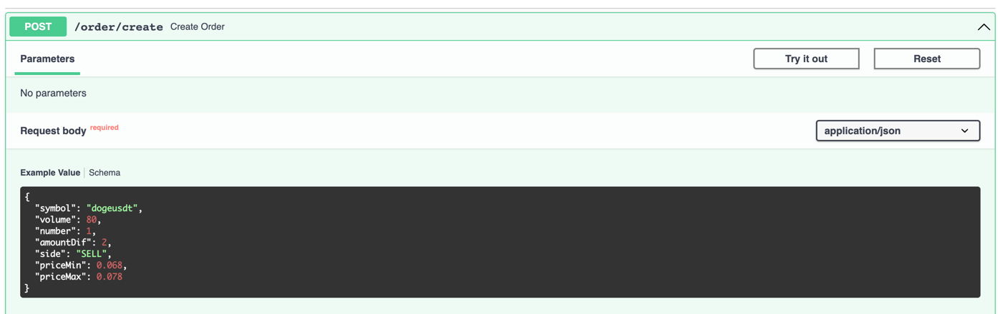

# binance-create-order-test

## Запуск

Необходимо задать следующие переменные окружения

```
BINANCE_API_KEY=
BINANCE_SECRET_KEY=
BINANCE_API_URL=
```

- `BINANCE_API_KEY` - API ключ для доступа к функциональности Binance
- `BINANCE_SECRET_KEY` - секретный ключ для подписывания реквестов 
- `BINANCE_API_URL` - URL Binance API ([Binance API](https://binance-docs.github.io/apidocs/spot/en/#general-info))

Установка зависимостей

```commandline
pip install -r requirements.txt
```

Сервис представляет собой простое API, написанное на FastAPI
(т.к. в ТЗ предполагалась, что данные для создания ордера будут приходить от фронт-енда)

Сам запуск

```commandline
uvicorn source.api.app:app --reload
```

```
INFO:     Uvicorn running on http://127.0.0.1:8000 (Press CTRL+C to quit)
INFO:     Started reloader process [94271] using WatchFiles
INFO:     Started server process [94273]
INFO:     Waiting for application startup.
INFO:     Application startup complete.
```

## Примеры запросов

Можно сделать через `curl`

```
curl -X 'POST' \
  'http://127.0.0.1:8000/order/create' \
  -H 'accept: application/json' \
  -H 'Content-Type: application/json' \
  -d '{
  "symbol": "dogeusdt",
  "volume": 80,
  "number": 1,
  "amountDif": 2,
  "side": "SELL",
  "priceMin": 0.068,
  "priceMax": 0.078
}'
```

Или через `swagger`, расположенный по адресу `http://127.0.0.1:8000/swagger`




## Тесты

Установка зависимостей

```commandline
pip install -r requirements-tests.txt
```

Запуск

```commandline
pytest tests/
```

```
tests/integration/test_api/test_create_order.py ......                                 [ 25%]
tests/unit/test_api/test_orders/test_create_order.py .....                             [ 45%]
tests/unit/test_clients/test_binance/test_client.py .......                            [ 75%]
tests/unit/test_clients/test_binance/test_schemas.py ....                              [ 91%]
tests/unit/test_clients/test_binance/test_signature.py ..                              [100%]
```